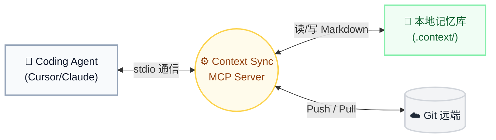
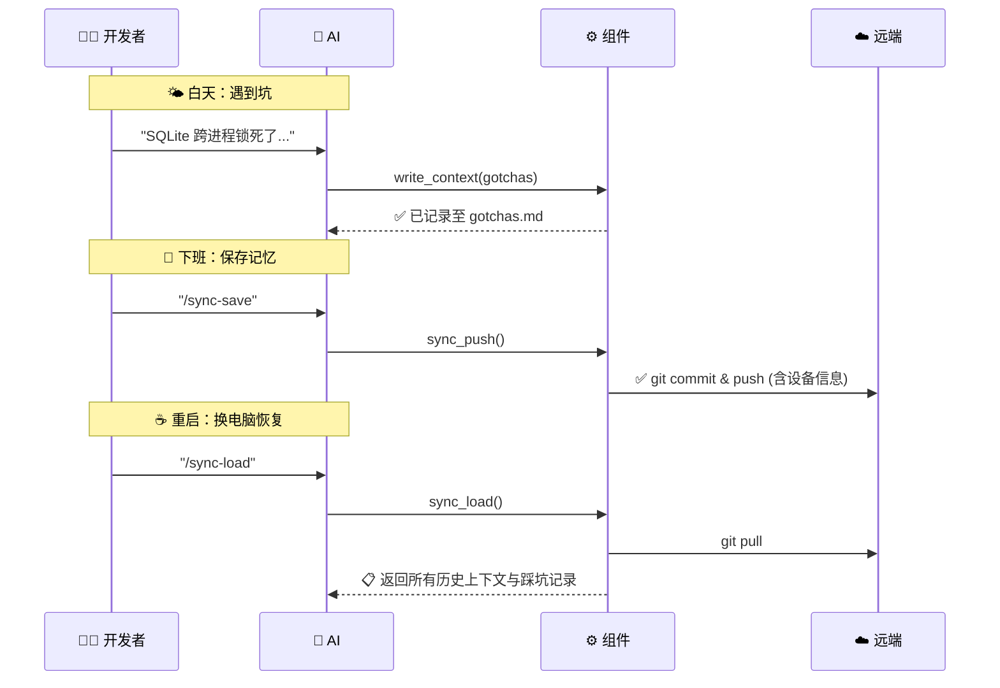

<h1 align="center">
  🔄 Context Sync MCP
</h1>

<p align="center">
  <b>Never Repeat Yourself to AI Again.</b><br>
  （让你的 Cursor / Claude Code 拥有跨设备、不遗忘的长期记忆）
</p>

<p align="center">
  <a href="https://www.npmjs.com/package/context-sync-mcp"></a>
  <a href="#"></a>
  <a href="#"></a>
  <a href="#"></a>
  <a href="#"></a>
  <a href="#"></a>
</p>

---

## 🎯 为什么需要它？

> ❌ **痛点**：在公司电脑用 Cursor 调了一天的 Bug，Agent 刚摸清代码库的脾气、知道哪个 API 会报错。换了台电脑，它又变成了“零记忆”，你不得不从头解释什么是历史包袱。
> 
> ✅ **解法**：Context Sync 为 Agent 提供了一个**独立于对话的长期记忆库**。基于 Git 和 MCP，换台电脑，敲一句 `/sync-load`，进度与上下文无缝衔接。

**工作流极简：**
踩坑了/新决策 → `write_context` 自动记录 → `sync_push` 推送 → 换电脑 `sync_load` 拉取。就是这么简单。

---

## ✨ 核心特性

| 特性 | 说明 |
| :--- | :--- |
| **🧠 结构化长期记忆** | 将零散的对话沉淀为 5 类标准文档（避雷点、架构决策等），拒绝遗忘。 |
| **🔗 关联与自动编号** | 踩坑记录自动递增编号，支持 `related_to` 双向跳转，构建项目的知识图谱。 |
| **⚡️ 极简跨端同步** | `sync_push` / `sync_load` 一键指令，背靠 Git 实现可靠的版本控制与多端漫游。 |
| **🛡️ 零冲突设计** | 内置 `.gitattributes` 与 `merge=ours` 策略，多设备并发写入从不打架。 |

### Token 消耗估算

| 操作 | 消耗 (Tokens) | 说明 |
|------|-----------|------|
| `write_context` | 💡 极低 (~200) | 取决于单次写入内容的长度 |
| `sync_push` | 💡 极低 (~20) | 固定调用指令开销 |
| `sync_load` | 📊 中等 (~2000) | 取决于 `.context/` 积累的文件总量 |

> **一句话总结**：日常开发一整天（5-10次写入 + 1次同步），额外消耗仅约 2k-5k tokens，对账单几乎无影响。

---

## 📦 极速安装与配置

不需要手动折腾 JSON，**直接让 Agent 帮你搞定一切**。

### 前置要求
- **Node.js** ≥ 18.0.0
- **Git** 已安装并配置好 SSH/HTTPS 认证
- 当前目录在一个 Git 仓库内

### 让你的coding agent帮你配置

复制下面这段话，**直接发给你的 Codex 或 Claude Code**，剩下的交给它：

```text
帮我安装并配置 context-sync-mcp。  
1. 运行 `npm install -g context-sync-mcp`  
2. 找到 context-sync-mcp 的安装路径（运行 `which context-sync-mcp` 或 `npm root -g`），确认 `dist/index.js` 的绝对路径  
3. 帮我注册这个 MCP server（使用你的标准 MCP 配置命令或修改相应的 mcp.json）。command 是 `node`，args 是 `["/绝对路径/context-sync-mcp/dist/index.js"]`  
4. 把下面的规则内容，追加写入到你的全局系统提示词、`.cursorrules`、`CLAUDE.md` 或任何适合你读取的项目/全局级规则配置中：  

你有 context-sync MCP 工具。开发过程中：
- 踩坑了 → write_context 写到 gotchas
- 做了架构决策 → 写到 architecture
- 发现 API 特殊行为 → 写到 api_notes
- 完成阶段任务 → 更新 progress
- 用户说 /sync-save → 调 sync_push
- 用户说 /sync-load → 调 sync_load
```

> 🪄 **配置完成后，你不需要记忆任何额外命令**。像平常一样自然地写代码、提问，Agent 知道什么时候该记录。下班前对它说一句 `/sync-save` 即可。

---

<details>
<summary><b>▸ 展开查看：手动安装指南</b>（如果你偏爱自己动手）</summary>

### 步骤 1：安装 CLI

```bash
npm install -g context-sync-mcp
```

### 步骤 2：注册 MCP

**Cursor** — 编辑 `~/.cursor/mcp.json`（全局）或项目的 `.cursor/mcp.json`：
```json
{
  "mcpServers": {
    "context-sync": {
      "command": "node",
      "args": ["/绝对路径/context-sync-mcp/dist/index.js"]
    }
  }
}
```

**Claude Code** — 运行：
```bash
claude mcp add context-sync node /绝对路径/context-sync-mcp/dist/index.js
```

**OpenAI Codex** — 运行：
```bash
codex mcp add context-sync -- node /绝对路径/context-sync-mcp/dist/index.js
```

**Google Antigravity** — 编辑项目根目录的 `mcp_config.json` 或 `.mcp.json`：
```json
{
  "mcpServers": {
    "context-sync": {
      "type": "local",
      "command": "node",
      "args": ["/绝对路径/context-sync-mcp/dist/index.js"]
    }
  }
}
```

### 步骤 3：注入提示词

将本项目 `rules/` 目录下的模板复制到你的工作区：
- **Cursor**: 复制 `rules/context-sync.mdc` 到 `.cursor/rules/`
- **Claude Code**: 复制 `rules/CLAUDE.md` 内容到根目录的 `CLAUDE.md`
</details>

---

## 🏗️ 它是如何运转的？

我们优化了架构图，让你一眼看懂它的极简逻辑。



### 📖 极简数据流



---

## 🔧 工具 API 详情

<details>
<summary><b>▸ 展开查看 API 参数</b></summary>

### `write_context`
往 `.context/` 目录写入记录。

- `gotchas` (append): 踩坑记录、Bug 发现。
- `architecture` (append): 架构决策记录。
- `api_notes` (append): 接口行为说明。
- `progress` (overwrite): 当前任务进度。
- `summary` (overwrite): 项目整体索引。

### `sync_push`
将 `.context/` 推送到 Git 远端。自动生成 `SUMMARY.md`、防冲突配置 `.gitattributes` 与同步元信息 `sync_meta.json`。

### `sync_load`
从远端拉取最新上下文，按优先级展示给 Agent 供推理使用。

</details>

---

## 📁 文件结构与隔离

工具会在你的项目根目录生成一个干净的 `.context/` 文件夹，与业务代码完全隔离：

```text
your-project/
└── .context/                   
    ├── SUMMARY.md              # 总览索引
    ├── gotchas.md              # 踩坑本
    ├── architecture.md         # 架构决策
    ├── .gitattributes          # 自动防护：冲突时保留本地最新
    └── sync_meta.json          # 同步元数据 (设备识别)
```

> **最佳实践**：直接将 `.context/` 一并 commit 进业务代码仓库。如果你不希望污染业务代码，也可以在独立的文件夹（专用的 context 仓库）中运行 Agent。

---

<p align="center">
  <b>Business Source License 1.1 (BSL-1.1)</b><br>
  ✅ 个人学习/内部商用 ｜ ❌ 未经授权提供商业服务<br>
  <i>Made with ❤️ for developers who hate repeating themselves to AI.</i>
</p>
