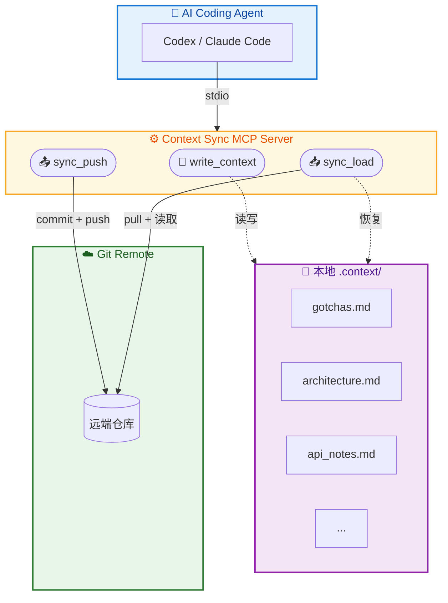
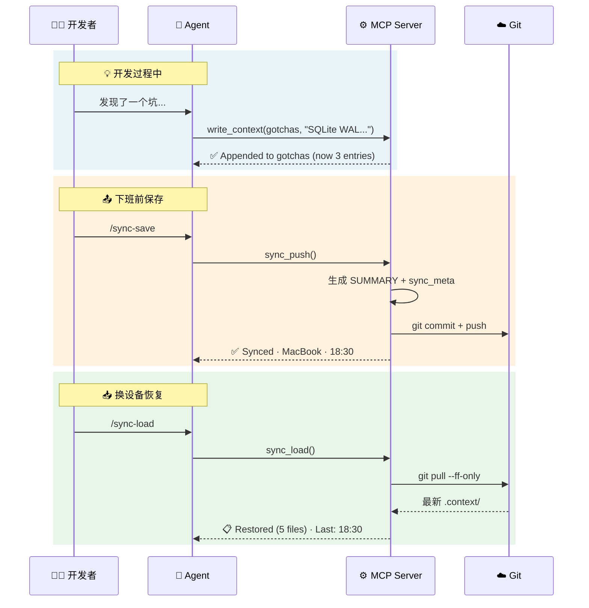

<h1 align="center">
  🔄 Context Sync MCP
</h1>

<p align="center">
  <b>让你的 AI 编程助手在不同设备之间记住上下文</b>
</p>

<p align="center">
  <a href="https://www.npmjs.com/package/context-sync-mcp"></a>
  <a href="#"></a>
  <a href="#"></a>
  <a href="#"></a>
  <a href="#"></a>
  <a href="#"></a>
</p>

---

## 🎯 这是什么

一个 [MCP](https://modelcontextprotocol.io/) 服务器，给 Cursor、Claude Code、Codex 这类 AI 编程助手加上「跨设备记忆」。

### 解决什么问题

> 你在公司电脑上用 Cursor 调了一天 Bug，Agent 帮你踩了不少坑、做了架构决策、摸清了几个 API 的脾气。  
> 回到家开了新会话，这些全没了，你得从头跟它解释一遍。

Context Sync 用 **3 个工具 + Git** 解决这件事：

```
写代码时遇到坑 → write_context 记下来 → sync_push 推到 Git
                                                ↓
换台电脑 / 开新会话 → sync_load 拉回来 ← 所有记忆都在
```

---

## ✨ 功能

| | 说明 |
|------|------|
| 📝 **5 类记录文件** | 踩坑记录、架构决策、API 笔记、任务进度、项目索引 |
| 🔢 **自动编号** | 踩坑和架构记录条目自动递增（`## 1.` → `## 2.` → ...） |
| 🔗 **条目关联** | 通过 `related_to` 自动生成跳转链接 |
| 📤 **一条命令推送** | `sync_push` 自动生成索引、提交、推送 |
| 📥 **一条命令恢复** | `sync_load` 拉取远端，按优先级展示所有记录 |
| 🔀 **不怕冲突** | 自动配置 `merge=ours`，多设备写入不打架 |

### Token 消耗

| 操作 | 输入 token | 输出 token | 说明 |
|------|-----------|-----------|------|
| `write_context` | ~200–500 | ~50 | 取决于写入内容长度 |
| `sync_push` | ~20 | ~50 | 固定开销，不随文件增长 |
| `sync_load` | ~20 | ~200–2000 | 取决于 `.context/` 文件总量 |

> 💡 日常开发一天大约 5–10 次 `write_context` + 1 次 push/load，**额外消耗约 2k–5k tokens**，基本可以忽略。

## 🏗️ 架构



### 数据流



---

## 📦 安装

### 前置要求

- **Node.js** ≥ 18.0.0
- **Git** 已安装并配置好 SSH/HTTPS 认证
- 一个 Git 仓库（你的项目本身，或一个专用的 context 仓库）

### 🚀 让 Agent 帮你配（推荐）

把下面这段话直接发给你的 Coding Agent，它会自动完成安装和配置：

> 帮我安装并配置 context-sync-mcp。  
> 1. 运行 `npm install -g context-sync-mcp`  
> 2. 找到 context-sync-mcp 的安装路径（`which context-sync-mcp` 或 `npm root -g`），确认 `dist/index.js` 的绝对路径  
> 3. 在当前项目的 `.cursor/mcp.json`（Cursor）或用 `claude mcp add`（Claude Code）注册这个 MCP server，command 是 `node`，args 是 `["/绝对路径/context-sync-mcp/dist/index.js"]`  
> 4. 把下面的规则写入项目的 `.cursor/rules/context-sync.mdc`（Cursor）或 `CLAUDE.md`（Claude Code）：  
>   
> ```
> 你有 context-sync MCP 工具。开发过程中：
> - 踩坑了 → write_context 写到 gotchas
> - 做了架构决策 → 写到 architecture
> - 发现 API 特殊行为 → 写到 api_notes
> - 完成阶段任务 → 更新 progress
> - 用户说 /sync-save → 调 sync_push
> - 用户说 /sync-load → 调 sync_load
> ```

---

<details>
<summary><b>手动配置</b>（如果你想自己来）</summary>

#### 步骤 1：安装

**从 npm 安装（推荐）**

```bash
npm install -g context-sync-mcp
```

**或从源码构建**

```bash
git clone https://github.com/1EchA/context-sync-mcp.git
cd context-sync-mcp
npm install
npm run build
```

#### 步骤 2：配置到你的 Agent

**Cursor** — 编辑 `~/.cursor/mcp.json`（全局）或项目的 `.cursor/mcp.json`：

```json
{
  "mcpServers": {
    "context-sync": {
      "command": "node",
      "args": ["/absolute/path/to/context-sync-mcp/dist/index.js"]
    }
  }
}
```

**Claude Code** — 运行：

```bash
claude mcp add context-sync node /absolute/path/to/context-sync-mcp/dist/index.js
```

**Cline (VS Code)** — 在 Cline 设置 → MCP Servers → 添加同样的 JSON。

**其他 Agent** — 任何支持 MCP stdio transport 的 Agent 都能用：`node /path/to/dist/index.js`

#### 步骤 3：配提示词

把 `rules/` 目录下的模板复制到你的项目：
- Cursor → 复制 `rules/context-sync.mdc` 到 `.cursor/rules/`
- Claude Code → 复制 `rules/CLAUDE.md` 的内容到 `CLAUDE.md`

</details>

---

## 🔧 工具 API

### `write_context`

往 `.context/` 目录写入记录，支持批量。

**参数：**

```typescript
{
  entries: Array<{
    file: "gotchas" | "architecture" | "api_notes" | "progress" | "summary",
    action: "append" | "overwrite",
    content: string,            // Markdown 格式内容
    related_to?: string[]       // 可选，关联 ID 如 ["ADR-1", "踩坑#2"]
  }>
}
```

**文件映射：**

| file key | 实际文件 | 推荐 action | 用途 |
|----------|----------|-------------|------|
| `gotchas` | `gotchas.md` | append | 踩坑记录、Bug 发现 |
| `architecture` | `architecture.md` | append | 架构决策记录（ADR） |
| `api_notes` | `api_notes.md` | append | 接口行为说明、限制 |
| `progress` | `task_progress.md` | overwrite | 当前任务进度 |
| `summary` | `SUMMARY.md` | overwrite | 项目上下文索引 |

**细节：**
- `gotchas` 和 `architecture` 会自动编号（`## 1.` → `## 2.` → ...）
- 空内容会跳过，不写入
- 相同内容覆写不会产生多余的 git diff
- `related_to` 会自动生成 Markdown 跳转链接

**示例：**

```json
{
  "entries": [
    {
      "file": "gotchas",
      "action": "append",
      "content": "## SQLite WAL 跨进程问题\n- **现象**：多进程写入报 SQLITE_BUSY\n- **原因**：WAL 模式不支持跨进程并发\n- **解决**：改用 journal_mode=DELETE",
      "related_to": ["ADR-1"]
    },
    {
      "file": "progress",
      "action": "overwrite",
      "content": "# 认证模块重构\n- [x] Session Store\n- [x] Auth Middleware\n- [ ] Logout 接口 ← 当前"
    }
  ]
}
```

---

### `sync_push`

将本地 `.context/` 推送到 Git 远端。

**参数：**

```typescript
{
  summary?: string  // 可选：自定义 SUMMARY.md 内容
}
```

**行为：**
1. 如果没有提供 `summary`，自动扫描所有 `.context/` 文件生成 `SUMMARY.md`
2. 确保 `.gitattributes` 存在（`merge=ours` 防冲突策略）
3. 写入 `sync_meta.json`（时间戳、设备名、Agent 类型）
4. `git add .context/ && git commit && git push`
5. 如果没有变更，返回 `ℹ️ No changes to push`

**响应示例：**

```
✅ Context synced successfully
   Device: MacBook-Pro · Agent: cursor
   ⏰ 2026-03-19T14:32:00Z
```

---

### `sync_load`

从 Git 远端拉取并恢复上下文。

**参数：**

```typescript
{
  topic?: string  // 可选：只加载特定主题，如 "gotchas"
}
```

**行为：**
1. `git pull --ff-only`（安全合并，不会 rebase）
2. 读取所有 `.context/*.md` 文件
3. 按优先级排序展示：SUMMARY → progress → gotchas → architecture → api_notes
4. 显示 `sync_meta.json` 的同步元信息

**三种场景：**

| 场景 | 响应 |
|------|------|
| 正常恢复 | `📋 Context restored (5 files loaded)` + 全部内容 |
| 指定主题 | 只返回该主题的内容 |
| 无 Git / 无 .context | 返回 **New Device Setup Guide** 引导步骤 |

---

## 📁 文件结构

### 项目结构

```
context-sync-mcp/
├── src/
│   ├── index.ts              # MCP Server 入口，3 个工具注册
│   ├── utils.ts              # 公共工具函数（文件读写、Git、格式化）
│   └── tools/
│       ├── write-context.ts   # write_context 实现
│       ├── sync-push.ts       # sync_push 实现
│       └── sync-load.ts       # sync_load 实现
├── test/                      # 7 套测试（272 assertions）
├── rules/                     # Agent 提示词模板
├── doc/                       # 设计文档 & 开发记录
├── package.json
└── tsconfig.json
```

### `.context/` 目录（由工具自动管理）

```
your-project/
└── .context/                   # 上下文记忆目录
    ├── SUMMARY.md              # 项目上下文索引（自动生成或手动覆写）
    ├── gotchas.md              # 踩坑记录（自动编号）
    ├── architecture.md         # 架构决策（自动编号）
    ├── api_notes.md            # 接口行为说明
    ├── task_progress.md        # 当前任务进度
    ├── sync_meta.json          # 同步元信息（时间、设备、Agent）
    └── .gitattributes          # merge=ours 防冲突策略
```

> 💡 建议将 `.context/` 加入你的项目 Git 仓库，这样上下文会随项目同步。  
> 也可以使用一个独立的 context 仓库，在非 Git 项目中使用。

---

## 🧪 测试

### 运行测试

```bash
# 单元测试 + 边缘测试（139 assertions）
npm test

# 跨设备集成测试（61 + 72 assertions）
npm run test:integration

# 全部测试（272 assertions）
npm run test:all
```

### 测试套件

| 套件 | 断言数 | 覆盖范围 |
|------|--------|----------|
| `e2e-runner` | 34 | 核心工具端到端流程 |
| `deep-audit` | 20 | 竞争条件、编号、Git 隔离 |
| `extended-audit` | 28 | Unicode、批量操作、错误处理 |
| `design-features` | 36 | 自动 SUMMARY、sync_meta、gitattributes |
| `final-audit` | 21 | 安全性、性能、幂等性 |
| `10-round-debug` | 61 | 2 台设备 10 轮完整生命周期 |
| `quality-test` | 72 | 响应质量、格式一致性、性能基准 |

<!-- 
### 测试截图

> 在此处添加你的测试截图
-->

---

## 💡 日常使用

### 写代码时踩了坑

跟 Agent 说一句就行：

> "Next.js Middleware 里不能用 fs 模块，帮我记一下"

Agent 会调 `write_context` 写入 `gotchas.md`，下次不会再踩。

### 下班了，推一下

> `/sync-save`

所有记录推送到 Git 远端，回家继续。

### 到家了，拉回来

> `/sync-load`

完整恢复所有记录：

```
📋 Context restored (5 files loaded)
   Last sync: 2026-03-19T18:30:00Z
   Device: MacBook-Pro · Agent: cursor

── SUMMARY.md ──
# 项目上下文索引
...

── gotchas.md ──
## 1. SQLite WAL 跨进程问题
...
## 2. Next.js Middleware 限制
...
```

<!-- 
### 实际使用截图

> 在此处添加你的使用截图
-->

---

## 📄 License

**Business Source License 1.1 (BSL-1.1)**

- ✅ 个人使用、学习、研究
- ✅ 内部商业使用（公司内部工具）
- ❌ 未经授权不得作为商业产品/服务的一部分对外提供
- 📅 变更日期后将自动转为 Apache 2.0

详见 [LICENSE](./LICENSE) 文件。
