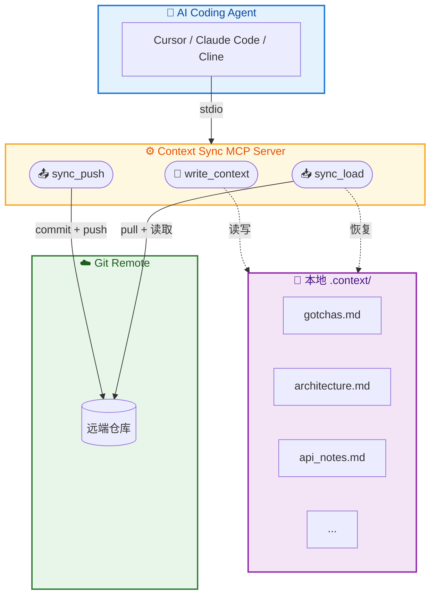
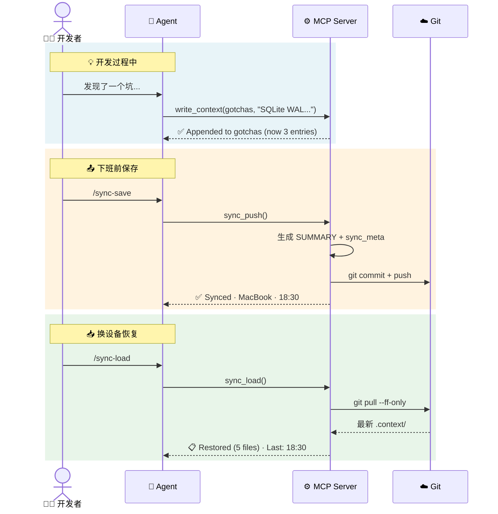

<h1 align="center">
  🔄 Context Sync MCP
</h1>

<p align="center">
  <b>跨设备编程上下文同步 —— 让 AI Coding Agent 拥有持久记忆</b>
</p>

<p align="center">
  <a href="#"></a>
  <a href="#"></a>
  <a href="#"></a>
  <a href="#"></a>
  <a href="#"></a>
</p>

---

## 🎯 这是什么

Context Sync MCP 是一个 [Model Context Protocol](https://modelcontextprotocol.io/) 服务器，为 AI Coding Agent（如 Cursor、Claude Code、Cline 等）提供**跨设备、跨会话的上下文记忆同步**能力。

### 痛点

> 你在公司电脑上用 Cursor 调了一天的 Bug，积累了大量上下文 —— 踩坑记录、架构决策、API 行为说明……  
> 回到家打开笔记本，开了一个新的 Chat，Agent 对这些一无所知，你只能从头解释。

### 解决方案

Context Sync 通过 **3 个 MCP 工具 + Git 同步** 解决这个问题：

```
Agent 发现问题 → write_context 记录 → sync_push 推到远端
                                              ↓
新设备 / 新会话 → sync_load 一键恢复 ← Git 自动拉取
```

---

## ✨ 核心功能

| 功能 | 说明 |
|------|------|
| 📝 **结构化记忆写入** | 5 种主题文件：踩坑记录、架构决策、API 说明、任务进度、项目索引 |
| 🔢 **自动编号** | gotchas/architecture 条目自动递增编号（`## 1.` → `## 2.` → ...） |
| 🔗 **轻量级关联** | `related_to` 自动生成 Markdown 内链（`[ADR-1](architecture.md#adr-1)`） |
| 📤 **一键推送** | `sync_push` = 自动生成 SUMMARY + git commit + push |
| 📥 **一键恢复** | `sync_load` = git pull + 展示所有上下文 + 同步元信息 |
| 🔀 **跨设备无冲突** | `.gitattributes` 自动配置 `merge=ours` 策略 |
| 📊 **智能反馈** | 写入后显示条目数，推送后显示设备/时间信息 |

---

## 🏗️ 架构



### 数据流



---

## 📦 安装

### 前置要求

- **Node.js** ≥ 18.0.0
- **Git** 已安装并配置好 SSH/HTTPS 认证
- 一个 Git 仓库（你的项目本身，或一个专用的 context 仓库）

### 步骤 1：克隆并构建

```bash
git clone https://github.com/1EchA/context-sync-mcp.git
cd context-sync-mcp
npm install
npm run build
```

### 步骤 2：配置到你的 Agent

<details>
<summary><b>Cursor</b></summary>

编辑 `~/.cursor/mcp.json`（全局）或项目根目录的 `.cursor/mcp.json`：

```json
{
  "mcpServers": {
    "context-sync": {
      "command": "node",
      "args": ["/absolute/path/to/context-sync-mcp/dist/index.js"]
    }
  }
}
```

</details>

<details>
<summary><b>Claude Code</b></summary>

运行：

```bash
claude mcp add context-sync node /absolute/path/to/context-sync-mcp/dist/index.js
```

或编辑 `~/.claude.json`：

```json
{
  "mcpServers": {
    "context-sync": {
      "command": "node",
      "args": ["/absolute/path/to/context-sync-mcp/dist/index.js"]
    }
  }
}
```

</details>

<details>
<summary><b>Cline (VS Code)</b></summary>

在 Cline 设置 → MCP Servers → 添加：

```json
{
  "context-sync": {
    "command": "node",
    "args": ["/absolute/path/to/context-sync-mcp/dist/index.js"]
  }
}
```

</details>

<details>
<summary><b>其他 MCP 兼容 Agent</b></summary>

Context Sync 使用标准的 **stdio transport**，任何支持 MCP 的 Agent 都可以通过以下命令启动：

```bash
node /path/to/context-sync-mcp/dist/index.js
```

</details>

### 步骤 3：给 Agent 配置提示词

将以下规则添加到你的 Agent 系统提示或 Rules 文件中（如 `.cursorrules`）：

```markdown
## 上下文同步

你拥有 context-sync MCP 工具。请遵循以下规则：

1. **发现踩坑**时，用 `write_context` 记录到 `gotchas`
2. **做架构决策**时，用 `write_context` 记录到 `architecture`  
3. **发现 API 特殊行为**时，记录到 `api_notes`
4. **完成阶段任务**时，更新 `progress`
5. 用户说 `/sync-save` 时，调用 `sync_push`
6. 用户说 `/sync-load` 时，调用 `sync_load`
```

> 💡 项目 `rules/` 目录下有预写好的提示词模板，可以直接使用。

---

## 🔧 工具 API

### `write_context`

批量写入记忆条目到 `.context/` 目录。

**参数：**

```typescript
{
  entries: Array<{
    file: "gotchas" | "architecture" | "api_notes" | "progress" | "summary",
    action: "append" | "overwrite",
    content: string,            // Markdown 格式内容
    related_to?: string[]       // 可选，关联 ID 如 ["ADR-1", "踩坑#2"]
  }>
}
```

**文件映射：**

| file key | 实际文件 | 推荐 action | 用途 |
|----------|----------|-------------|------|
| `gotchas` | `gotchas.md` | append | 踩坑记录、Bug 发现 |
| `architecture` | `architecture.md` | append | 架构决策记录（ADR） |
| `api_notes` | `api_notes.md` | append | 接口行为说明、限制 |
| `progress` | `task_progress.md` | overwrite | 当前任务进度 |
| `summary` | `SUMMARY.md` | overwrite | 项目上下文索引 |

**特性：**
- `gotchas` 和 `architecture` 自动编号（`## 1.` → `## 2.` → ...）
- 空内容自动跳过（返回 `⏩ Skipped`）
- 相同内容覆写不产生 git diff（幂等优化）
- `related_to` 自动生成 Markdown 内链

**示例：**

```json
{
  "entries": [
    {
      "file": "gotchas",
      "action": "append",
      "content": "## SQLite WAL 跨进程问题\n- **现象**：多进程写入报 SQLITE_BUSY\n- **原因**：WAL 模式不支持跨进程并发\n- **解决**：改用 journal_mode=DELETE",
      "related_to": ["ADR-1"]
    },
    {
      "file": "progress",
      "action": "overwrite",
      "content": "# 认证模块重构\n- [x] Session Store\n- [x] Auth Middleware\n- [ ] Logout 接口 ← 当前"
    }
  ]
}
```

---

### `sync_push`

将本地 `.context/` 推送到 Git 远端。

**参数：**

```typescript
{
  summary?: string  // 可选：自定义 SUMMARY.md 内容
}
```

**行为：**
1. 如果没有提供 `summary`，自动扫描所有 `.context/` 文件生成 `SUMMARY.md`
2. 确保 `.gitattributes` 存在（`merge=ours` 防冲突策略）
3. 写入 `sync_meta.json`（时间戳、设备名、Agent 类型）
4. `git add .context/ && git commit && git push`
5. 如果没有变更，返回 `ℹ️ No changes to push`

**响应示例：**

```
✅ Context synced successfully
   Device: MacBook-Pro · Agent: cursor
   ⏰ 2026-03-19T14:32:00Z
```

---

### `sync_load`

从 Git 远端拉取并恢复上下文。

**参数：**

```typescript
{
  topic?: string  // 可选：只加载特定主题，如 "gotchas"
}
```

**行为：**
1. `git pull --ff-only`（安全合并，不会 rebase）
2. 读取所有 `.context/*.md` 文件
3. 按优先级排序展示：SUMMARY → progress → gotchas → architecture → api_notes
4. 显示 `sync_meta.json` 的同步元信息

**三种场景：**

| 场景 | 响应 |
|------|------|
| 正常恢复 | `📋 Context restored (5 files loaded)` + 全部内容 |
| 指定主题 | 只返回该主题的内容 |
| 无 Git / 无 .context | 返回 **New Device Setup Guide** 引导步骤 |

---

## 📁 文件结构

### 项目结构

```
context-sync-mcp/
├── src/
│   ├── index.ts              # MCP Server 入口，3 个工具注册
│   ├── utils.ts              # 公共工具函数（文件读写、Git、格式化）
│   └── tools/
│       ├── write-context.ts   # write_context 实现
│       ├── sync-push.ts       # sync_push 实现
│       └── sync-load.ts       # sync_load 实现
├── test/                      # 7 套测试（272 assertions）
├── rules/                     # Agent 提示词模板
├── doc/                       # 设计文档 & 开发记录
├── package.json
└── tsconfig.json
```

### `.context/` 目录（由工具自动管理）

```
your-project/
└── .context/                   # 上下文记忆目录
    ├── SUMMARY.md              # 项目上下文索引（自动生成或手动覆写）
    ├── gotchas.md              # 踩坑记录（自动编号）
    ├── architecture.md         # 架构决策（自动编号）
    ├── api_notes.md            # 接口行为说明
    ├── task_progress.md        # 当前任务进度
    ├── sync_meta.json          # 同步元信息（时间、设备、Agent）
    └── .gitattributes          # merge=ours 防冲突策略
```

> 💡 建议将 `.context/` 加入你的项目 Git 仓库，这样上下文会随项目同步。  
> 也可以使用一个独立的 context 仓库，在非 Git 项目中使用。

---

## 🧪 测试

### 运行测试

```bash
# 单元测试 + 边缘测试（139 assertions）
npm test

# 跨设备集成测试（61 + 72 assertions）
npm run test:integration

# 全部测试（272 assertions）
npm run test:all
```

### 测试套件

| 套件 | 断言数 | 覆盖范围 |
|------|--------|----------|
| `e2e-runner` | 34 | 核心工具端到端流程 |
| `deep-audit` | 20 | 竞争条件、编号、Git 隔离 |
| `extended-audit` | 28 | Unicode、批量操作、错误处理 |
| `design-features` | 36 | 自动 SUMMARY、sync_meta、gitattributes |
| `final-audit` | 21 | 安全性、性能、幂等性 |
| `10-round-debug` | 61 | 2 台设备 10 轮完整生命周期 |
| `quality-test` | 72 | 响应质量、格式一致性、性能基准 |

<!-- 
### 测试截图

> 在此处添加你的测试截图
-->

---

## 💡 使用示例

### 场景 1：发现踩坑，随手记录

对 Agent 说：

> "我发现 Next.js Middleware 里不能用 Node.js 的 fs 模块，记录到踩坑"

Agent 会自动调用：

```json
{
  "tool": "write_context",
  "entries": [{
    "file": "gotchas",
    "action": "append",
    "content": "## Next.js Middleware 限制\n- **现象**：Edge Runtime 不支持 fs 模块\n- **解决**：移到 API Route"
  }]
}
```

### 场景 2：下班前同步

对 Agent 说：

> `/sync-save`

Agent 调用 `sync_push()`，所有上下文推到远端。

### 场景 3：换设备恢复上下文

在新设备上对 Agent 说：

> `/sync-load`

Agent 调用 `sync_load()`，完整恢复所有记忆：

```
📋 Context restored (5 files loaded)
   Last sync: 2026-03-19T18:30:00Z
   Device: MacBook-Pro · Agent: cursor

── SUMMARY.md ──
# 项目上下文索引
...

── gotchas.md ──
## 1. SQLite WAL 跨进程问题
...
## 2. Next.js Middleware 限制
...
```

<!-- 
### 实际使用截图

> 在此处添加你的使用截图
-->

---

## 📄 License

**Business Source License 1.1 (BSL-1.1)**

- ✅ 个人使用、学习、研究
- ✅ 内部商业使用（公司内部工具）
- ❌ 未经授权不得作为商业产品/服务的一部分对外提供
- 📅 变更日期后将自动转为 Apache 2.0

详见 [LICENSE](./LICENSE) 文件。
